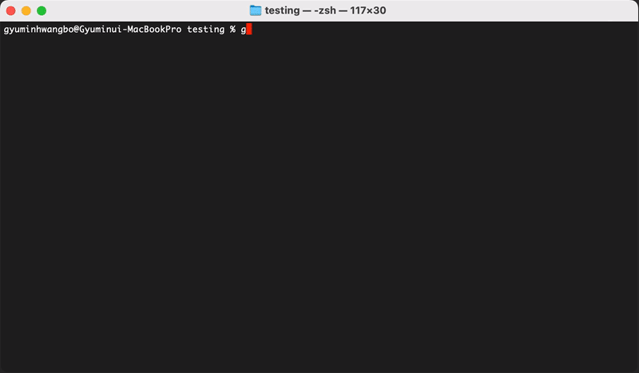
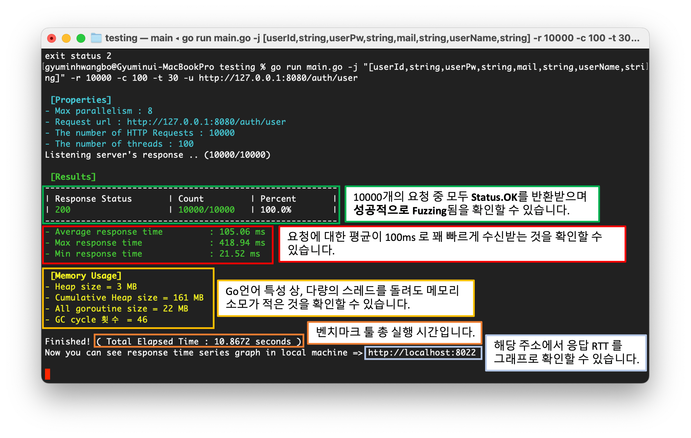
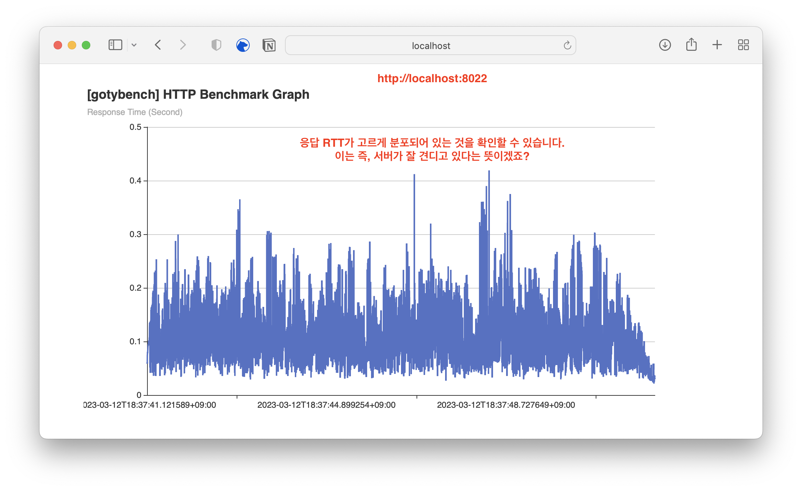
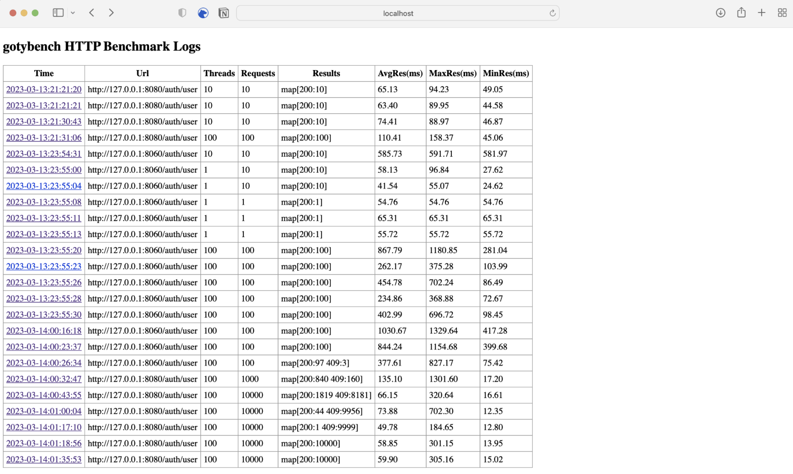

# Introduction(gotybench)



> Currently we service only for HTTP Post request! Later we will add Get/Put Methods

# Goal of GotyBench

1. Concurrency : Developed with goroutine lightweight multi-threaded, set to communicate through channels.
2. Automatically generate fuzzed json object : It is designed to automatically create a random json object when the user sets only the key and value type.
    * ex) "gotybench -j [userId,string,userAge,int]" : Set the value of `userId` to a random string. Also set the value of `userAge` to a random int.
3. Log Server : By `-s` option, we can check all benchmark logs([http://localhost:8022](http://localhost:8022))

# Options
| Option | Detail                                                                                                                                                                                                                                                                                               |
|--------|------------------------------------------------------------------------------------------------------------------------------------------------------------------------------------------------------------------------------------------------------------------------------------------------------|
| -c     | The number of concurrent thread                                                                                                                                                                                                                                                                      |
| -h     | See all options                                                                                                                                                                                                                                                                                      |
| -j     | Generate fuzzed json object <br> If you set the key/type of the json object with the corresponding option, a json object with a random value is created.<br>Four types of fuzzing are supported as follows.<br>int, float, string, boolean<br>Usage Example<br>ex) `-j "[userId,string,userAge,int]"` |
| -r     | The number of HTTP Post request                                                                                                                                                                                                                                                                      |
| -t     | The timeout of the network connection of the benchmark client                                                                                                                                                                                                                                        |
| -u     | Request URL                                                                                                                                                                                                                                                                                          |
| -s     | Access log server                                                                                                                                                                                                                                                                                    |
| -i     | Add additional information                                                                                                                                                                                                                                                                           |

# Before we started, we need to get ...
1. run `go get github.com/fatih/color` for coloring your terminal
2. run `go get -v github.com/gosuri/uilive` for updating process
3. run `go get -u github.com/go-echarts/go-echarts/v2/...` to see graph with responses in timeseries.
4. run `go get github.com/ompluscator/dynamic-struct` to dynamically add field of json structs.

# Usage
1. run `go run main.go` in your terminal and see options

	```bash
	Alloc = 0 MiB	TotalAlloc = 0 MiB	Sys = 8 MiB	NumGC = 0
		Properties
		- Max parallelism : 8
	Usage of /var/folders/h0/_d_zrr0j57x8wmknjb1r6hfm0000gn/T/go-build3252492082/b001/exe/main:
	-c int
			스레드 개수 (default 100)
	-j string
			Json "[KEY1,TYPE1,KEY2,TYPE2,...]" 
	-r int
			요청 개수 (default 10000)
	-t int
			요청 타임아웃(second) (default 30)
	-u string
			URL
	```                                                    
2. choose your options and run

# Example

```bash
$ go run main.go -j "[userId,string,userPw,string,mail,string,userName,string]" -r 10000 -c 1000 -u http://127.0.0.1:8080/auth/user

 [Properties]
- Max parallelism : 8
- Request url : http://127.0.0.1:8080/auth/user
- The number of HTTP Requests : 10000
- The number of threads : 100
Listening server's response .. (10000/10000)

 [Results]
---------------------------------------------------------
| Response Status 	| Count 	| Percent 	|
| 200 			| 10000/10000 	| 100.0%	|
---------------------------------------------------------
- Average response time 	: 110.66 ms
- Max response time     	: 770.32 ms
- Min response time     	: 21.46 ms

 [Memory Usage]
- Heap size = 2 MB
- Cumulative Heap size = 161 MB
- All goroutine size = 22 MB
- GC cycle 횟수 = 48

Finished! ( Total Elapsed Time : 11.4659 seconds ) 
Now you can see response time series graph in local machine => http://localhost:8022 

```

# Results

### **Benchmark Results**

### **Response RTT graph over time**

### **Log Server**

